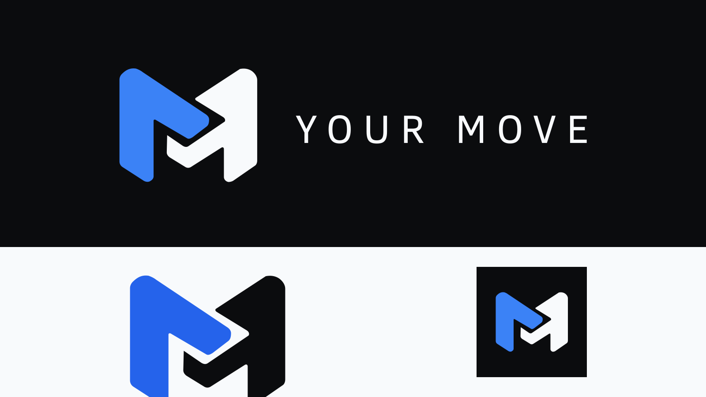

# Your Move — brand

> **GITHUB MOVES. YOUR TURN.**

Four words that say the product better than any sentence written for it. Use it wherever the name alone is not enough — the README, the OAuth App page, a store listing. Small caps, wide tracking.



## The mark

A folded **M** made from two interlocking forms. The left form moves forward; the right form receives it. The handover is drawn by the negative-space channel between them, so the mark reads as movement without adding a literal play button or a separate arrow.

The two halves are still **your move** and **their move**, but the gesture is cleaner and more direct at small sizes. The silhouette holds at favicon scale and the inner handoff becomes legible from 32px upwards.

It is drawn as filled Bézier paths, and the lettering is converted to outlines, so nothing here needs a font installed where it is rendered. This is the mark the app ships: `public/icons/` and `assets/` are rendered from `svg/` below.

## Files

| Use | SVG source | PNG export |
| --- | --- | --- |
| GitHub OAuth App, store listings | [`svg/icon.svg`](svg/icon.svg) | [`png/icon-1024.png`](png/icon-1024.png) |
| Symbol on dark backgrounds | [`svg/mark.svg`](svg/mark.svg) | [`png/mark-1200.png`](png/mark-1200.png) |
| Symbol on light backgrounds | [`svg/mark-light.svg`](svg/mark-light.svg) | [`png/mark-light-1200.png`](png/mark-light-1200.png) |
| One-colour symbol | [`svg/mark-mono.svg`](svg/mark-mono.svg) | [`png/mark-mono-1200.png`](png/mark-mono-1200.png) |
| Symbol and wordmark, dark | [`svg/logo.svg`](svg/logo.svg) | [`png/logo-2880.png`](png/logo-2880.png) |
| Symbol and wordmark, light | [`svg/logo-light.svg`](svg/logo-light.svg) | [`png/logo-light-2880.png`](png/logo-light-2880.png) |
| Symbol and wordmark, one colour | [`svg/logo-mono.svg`](svg/logo-mono.svg) | [`png/logo-mono-2880.png`](png/logo-mono-2880.png) |
| App icon, favicon, anything square | [`svg/icon.svg`](svg/icon.svg) | `png/icon-{16,32,180,192,512,1024}.png` |
| App icon on a light ground | [`svg/icon-light.svg`](svg/icon-light.svg) | [`png/icon-light-512.png`](png/icon-light-512.png) |
| Android home screen, adaptive icons | [`svg/icon-maskable.svg`](svg/icon-maskable.svg) | [`png/icon-maskable-512.png`](png/icon-maskable-512.png) |
| Link preview — OpenGraph, X | — composed | [`png/og-1200x630.png`](png/og-1200x630.png) |

`mark*` and `logo*` have transparent backgrounds; the mono variants are ice white. The `icon*` variants are opaque and square and leave launcher rounding to the operating system. The maskable variant keeps the whole mark inside Android's safe area.

The lockup frame sits tight to the artwork: the three `logo*` variants share an identical `0 0 1202 352` viewBox with equal padding left and right (about 33px, matching the mark's framing) and equal padding top and bottom. Only the fills differ between variants, so every export centres without per-variant offsets.

Default to the dark palette. On a light ground use the `-light` files so the companion half remains visible.

## Colours

| Role | Dark identity | Light identity |
| --- | --- | --- |
| Motion / active form | `#3B82F6` | `#2563EB` |
| Companion / wordmark | `#F8FAFC` | `#0B0C0E` |
| Ground | `#0B0C0E` | `#F8FAFC` |
| Secondary neutral | `#9CA3AF` | `#9CA3AF` |

The palette is intentionally colder and more energetic than the previous rose / ivory treatment:

- **Electric blue** is the movement colour. It feels active rather than soft, and gives the handoff a more technical, immediate character.
- **Ice white** keeps the receiving half bright without the cream/pastel cast that made the old mark feel detached from the interface.
- **Void** is exactly the app's near-black ground, so the identity belongs to the product even though the brand accent is now blue.
- **Slate** is the neutral supporting tone for captions and secondary brand material; it is not used to encode workflow state.

The blue has about **5.3:1** contrast against the dark ground, while the ice white is about **18.7:1**. The light-background blue is darkened to `#2563EB` to preserve roughly **4.9:1** against ice white.

The blue is a **brand colour, not a workflow-state colour**. The application's existing rose accent can therefore continue to mean “your move” inside the board without the logo competing with that semantic signal.

> [!IMPORTANT]
> **No strokes, no fonts, no embedded raster anywhere in the SVG sources.** Every form is a filled path and the wordmark is outlined. Keep it that way: the SVGs must remain deterministic inputs for every raster export.

## Regenerate the PNGs

Never edit a PNG. Exports are produced with `sharp`, already in `node_modules` — Inkscape is not required. The recipe throughout is `sharp(src).resize({ width }).png().toFile(out)`:

```sh
node -e "require('sharp')('brand/svg/logo.svg').resize({ width: 2880 }).png().toFile('brand/png/logo-2880.png')"
```

Marks export at width 1200 and icons at their listed sizes following the same pattern.

The link preview is composed from the dark lockup and written to both `png/og-1200x630.png` and `app/opengraph-image.png`: a 1200x630 `#0B0C0E` canvas with `logo.svg` rendered at width 560, centred horizontally (left 320) and vertically (top `Math.round((630 - logoHeight) / 2)`).

`preview.png` is composed the same way: a 1600x900 `#0B0C0E` canvas, a 1600x340 `#F8FAFC` band at top 560, `logo.svg` at width 1120 (left 240, top 120), `mark-light.svg` at width 420 (left 260, top 585) and `icon.svg` at width 250 (left 1080, top 605). Each element's box is centred in its area, so with centred artwork the composition lands centred too.

Keep the emblem geometry consistent across every variant, and preserve the negative-space handoff channel in mono — it is what separates the two halves when the colour is gone.
