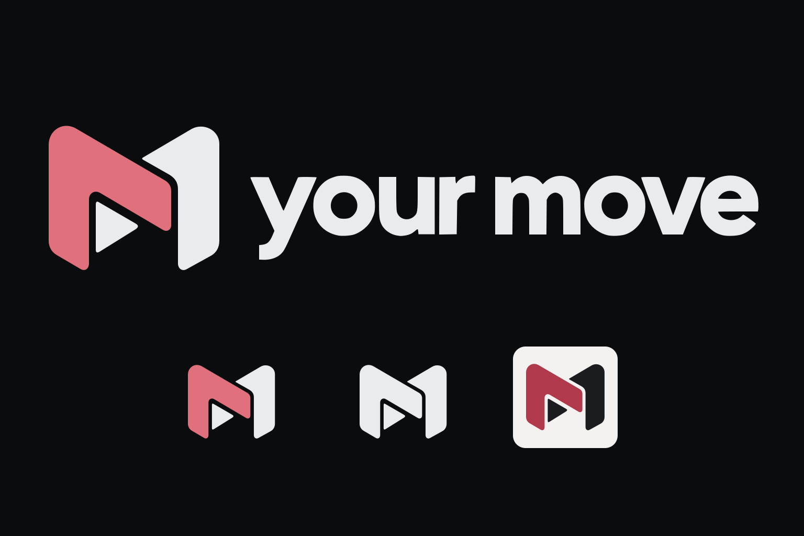

# Your Move — handover identity



The approved folded **M** combines interlocking rose and ivory forms with a
forward-pointing inset. It represents the handover between **your move** and
**their move**.

The emblem has been redrawn as clean Bézier paths from the approved concept.
The lettering follows the approved image and is converted to outlines, so the
SVGs need no installed font. All PNGs are rendered from these SVG sources.
The artwork uses solid fills, with no embedded raster images, strokes, effects,
or external dependencies.

## Files

| Use | SVG source | PNG export |
| --- | --- | --- |
| Symbol on dark backgrounds | [`svg/mark.svg`](svg/mark.svg) | [`png/mark-1200.png`](png/mark-1200.png) |
| Symbol on light backgrounds | [`svg/mark-light.svg`](svg/mark-light.svg) | [`png/mark-light-1200.png`](png/mark-light-1200.png) |
| One-colour symbol | [`svg/mark-mono.svg`](svg/mark-mono.svg) | [`png/mark-mono-1200.png`](png/mark-mono-1200.png) |
| Symbol and wordmark on dark backgrounds | [`svg/logo.svg`](svg/logo.svg) | [`png/logo-2880.png`](png/logo-2880.png) |
| Symbol and wordmark on light backgrounds | [`svg/logo-light.svg`](svg/logo-light.svg) | [`png/logo-light-2880.png`](png/logo-light-2880.png) |
| One-colour symbol and wordmark | [`svg/logo-mono.svg`](svg/logo-mono.svg) | [`png/logo-mono-2880.png`](png/logo-mono-2880.png) |
| Dark app icon | [`svg/icon.svg`](svg/icon.svg) | `png/icon-{16,32,180,192,512,1024}.png` |
| Light app icon | [`svg/icon-light.svg`](svg/icon-light.svg) | [`png/icon-light-512.png`](png/icon-light-512.png) |
| Android adaptive icon | [`svg/icon-maskable.svg`](svg/icon-maskable.svg) | [`png/icon-maskable-512.png`](png/icon-maskable-512.png) |

`mark*` and `logo*` have transparent backgrounds. The mono variants are ivory;
recolour their path fills for other single-ink uses. The icon variants are
opaque, square, and leave launcher rounding to the operating system. The
maskable variant keeps the complete mark inside the central safe circle of
radius 40% of the canvas width.

The default mark and logo use the dark palette. On light backgrounds, use the
`-light` files so the ivory portions remain visible. The filenames' numbers
give the PNG width; marks are 1200 × 1056, and lockups are 2880 × 704.

## Colours

| Element | Dark | Light |
| --- | --- | --- |
| Accent form | `#e0707c` | `#b03a4c` |
| Companion form and lettering | `#e9ebee` | `#1a1c1f` |
| App-icon background | `#0b0c0e` | `#f4f2f0` |

## Regenerate PNGs

From the repository root, with Inkscape installed:

```sh
for name in mark mark-light mark-mono; do
  inkscape "brand/handover/svg/$name.svg" --export-type=png \
    --export-width=1200 --export-filename="brand/handover/png/$name-1200.png"
done

for name in logo logo-light logo-mono; do
  inkscape "brand/handover/svg/$name.svg" --export-type=png \
    --export-width=2880 --export-filename="brand/handover/png/$name-2880.png"
done

for size in 16 32 180 192 512 1024; do
  inkscape brand/handover/svg/icon.svg --export-type=png \
    --export-width="$size" --export-filename="brand/handover/png/icon-$size.png"
done

for name in icon-light icon-maskable; do
  inkscape "brand/handover/svg/$name.svg" --export-type=png \
    --export-width=512 --export-filename="brand/handover/png/$name-512.png"
done
```

Edit SVG sources, then regenerate the PNGs. Keep the emblem geometry consistent
across all variants and preserve the empty channel between the forms in mono.
The 16px export retains the overall silhouette; its internal detail is clearer
at 32px and above.

## Integration

This bundle supplies the approved artwork without changing the running app.
When adopting it, update `assets/`, `public/icons/`, and the service-worker cache
version together so installed clients receive the new icons. The existing
inherited identity remains in `brand/svg/` and `brand/png/` until that change.
